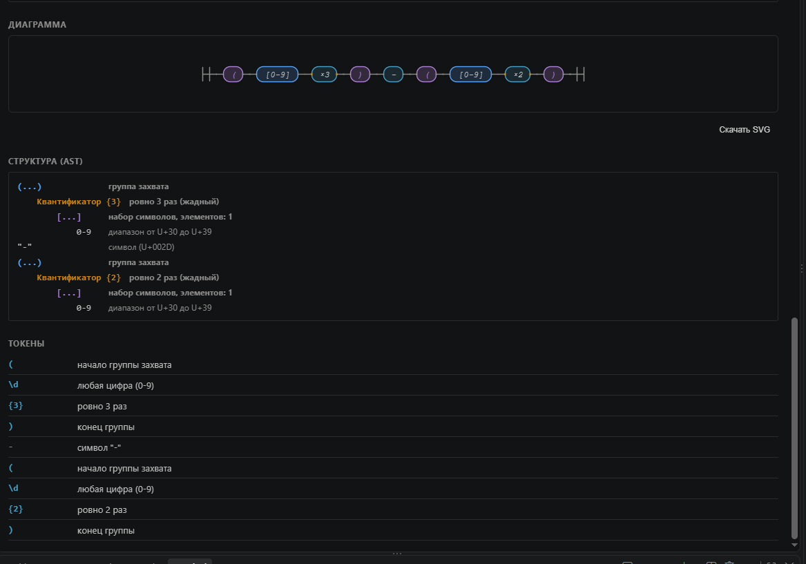
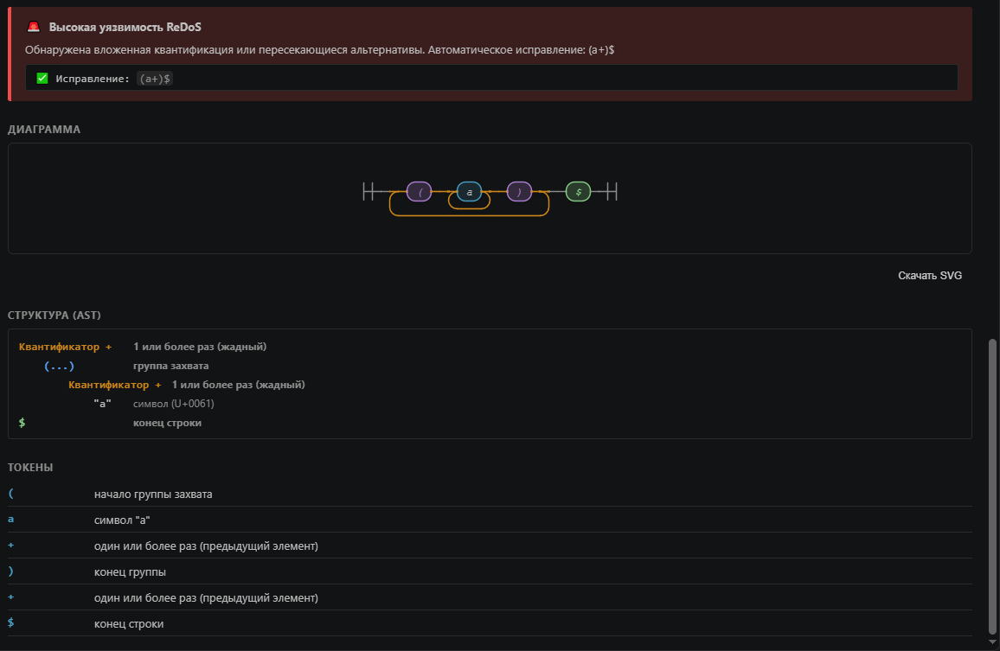
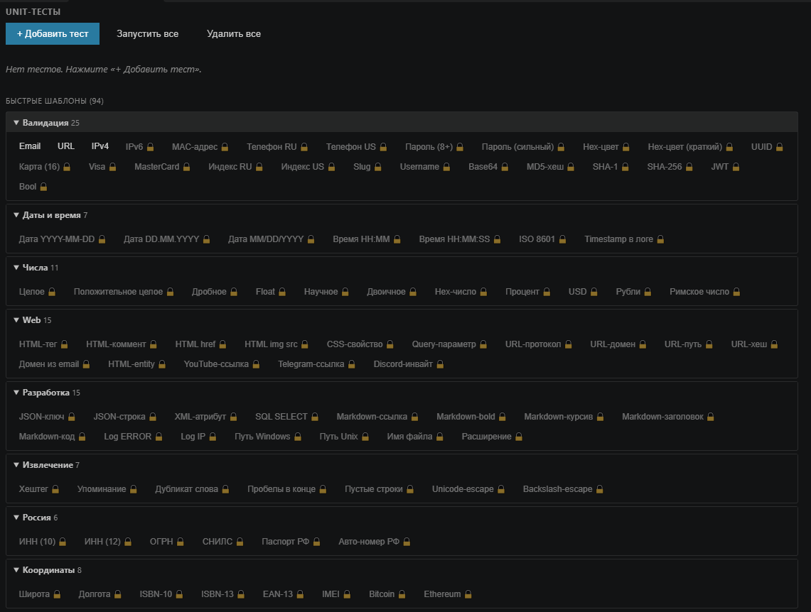

# Ghost Regex

**Work with regular expressions right inside VS Code. No browser tabs, no copy-paste, no surprises in production.**

Railroad diagrams, Explain with AST tree, ReDoS detector with auto-fix, Unit tests, and Preview on real files — all in one extension. Works fully offline.

---

## What it does

### 📊 Railroad diagram

Every token — visualized. Anchors in green, groups in purple, quantifiers in orange. Hover for tooltips with explanations. Export to SVG with one click.

### 🌳 Explain and AST tree

Parses regex into 100+ token types. Clear nesting structure — groups, quantifiers, lookaround. You see what the pattern actually does.

### 🛡️ ReDoS detector with auto-fix

Finds nested quantifiers before they become a problem. Shows vulnerability level (low / high / critical). Suggests a fixed pattern in one click.

### 🔍 Preview on real files

Pick a file — the extension highlights matches right in the content. Not in a sandbox, not on made-up strings. On real data.

### ✅ Unit tests for regex

Save test strings with expected results — run the pattern against the whole set with one button. Failed — you'll see a red ✗ on that specific test.

### 🔄 Convert to 5 languages

One regex — code for Python, JavaScript, Go, Rust, Java. With proper escaping.

### ⚡ 94 snippets

Email, URL, IPv4, UUID, JWT, dates, passwords — 8 categories of ready-made patterns. Paste and go.

### ↩️ Sync Back

Right-click on regex in code → "Explain selection" → edit in panel → "Apply to editor". All in one place.

---

## Keyboard shortcuts

- **Ctrl+Alt+R** — open Ghost Regex panel
- **Ctrl+Alt+E** — explain selected regex (or right-click in code)

---

## Free vs Pro

**Free** — full-featured tool, not a demo:
- Railroad diagram
- Explain + AST tree
- ReDoS detector
- Convert to Python and JavaScript
- 3 snippets (Email, URL, IPv4)
- Live test with flags
- Dialects: JavaScript, Python

**Pro — $6/month:**
- Preview on real files
- All 94 snippets
- Convert to Go, Rust, Java
- Dialects: Go, Rust, Java, PCRE
- Sync Back
- Export diagrams to SVG
- Unit tests for regex

[Get Pro on Boosty](https://boosty.to/ghostregex/purchase/4115716)

---

## Privacy

Everything runs locally inside VS Code. Preview reads files from your disk. ReDoS analysis runs on your machine. No server requests, no telemetry, no accounts.

**Your patterns stay yours.**

---

## Requirements

- VS Code 1.138.0 or higher
- Node.js 18+ (only for development)

---

## Feedback

Found a bug or have an idea? [Open an issue](https://github.com/XLKA11/ghost-regex/issues) or use the feedback form on our [landing page](https://ghost-regex-site.vercel.app#report).

---

## License

MIT